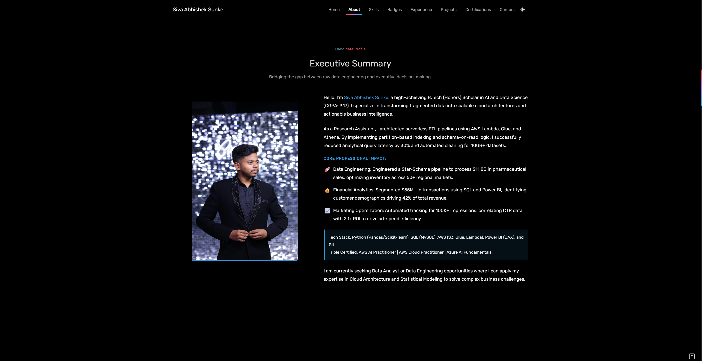

# 👋 Hi, I'm Abhishek Sunke

### Data Analyst | AWS Cloud Associate | AI & Data Science Undergraduate

  

  <b>Transforming Data into Business Insights with Analytics & Cloud Technologies</b>

---

## 🚀 About Me

🎓 B.Tech (Honors) in Artificial Intelligence & Data Science (CGPA: 9.27/10)  
📍 Hyderabad, India  
☁️ AWS Certified Cloud Practitioner | AWS Certified AI Practitioner  
📊 Passionate about Data Analytics, Business Intelligence, and Cloud Data Engineering  

I specialize in building **end-to-end data pipelines, ETL workflows, and analytics solutions** using **AWS, Python, SQL, and Power BI**.

I enjoy working on real-world datasets and turning them into **actionable business insights and dashboards** across Finance, Healthcare, and Digital domains.

---

## 💡 What I Bring

✅ Data Analytics & Business Intelligence  
✅ SQL & Python for Data Processing  
✅ AWS Cloud Data Engineering  
✅ Power BI Dashboard Development  
✅ ETL Pipeline Design & Automation  
✅ Data Modeling & Reporting  

---

## 🛠️ Tech Stack

### Languages & Databases
`Python` `SQL` `MySQL`

### Data Analytics & ML
`Pandas` `NumPy` `Scikit-learn` `Matplotlib` `Seaborn`  
`Machine Learning: Regression | Classification | Clustering | Predictive Analytics`

### Data Visualization
`Power BI` `DAX` `Power Query`

### Cloud & Data Engineering
`AWS Lambda` `AWS Glue` `Amazon S3` `Amazon Athena` `Amazon QuickSight`  
`ETL Pipelines` `Data Lake Architecture`

### Tools
`Git` `GitHub` `VS Code` `Jupyter Notebook` `Google Colab`

---

## 📈 Impact Highlights

| Achievement              | Impact                              |
| ------------------------ | ----------------------------------- |
| AWS Data Lake Project    | Processed 10GB+ YouTube dataset     |
| Pharmaceutical Analytics | Analyzed $11.8B sales data          |
| Financial Analytics      | Evaluated $55M+ transaction data    |
| Marketing Analytics      | Processed 100K+ ad impressions      |
| Query Optimization       | Reduced Athena latency by 30%       |

---

## 🔥 Featured Projects

### 💊 Pharmaceutical Sales & Inventory Engine
**Python • Pandas • Power BI • ETL**

* Processed **$11.8B pharmaceutical sales data**
* Built **Star Schema data model** in Power BI
* Identified key revenue drivers across 50+ regions
* Improved inventory optimization and reporting

---

### 💳 Credit Card Financial Analytics
**SQL • Power BI • DAX**

* Analyzed **$55M+ transaction dataset**
* Identified key customer segments contributing 42% revenue
* Built executive-level dashboards for financial insights
* Improved profitability and decision-making visibility

---

### 📢 Meta Ad Performance Analytics
**Power BI • Marketing Analytics**

* Processed **100K+ ad impressions**
* Identified high-performing audience segments (18–34 age group)
* Automated KPIs: ROAS, CTR, CPC tracking
* Improved ad spend efficiency by 2.1x ROI correlation

---

## 💼 Professional Experience

### Research Assistant – Data Engineering  
**Koneru Lakshmaiah University**  
*Dec 2025 – Mar 2026*

* Designed serverless ETL pipelines using AWS Lambda and AWS Glue
* Built scalable AWS Data Lake architecture using S3 and Athena
* Automated schema evolution and data transformation workflows
* Developed QuickSight dashboards for business reporting

---

## 🏆 Certifications

🏅 AWS Certified AI Practitioner  
🏅 AWS Certified Cloud Practitioner  
🏅 Microsoft Certified: Azure AI Fundamentals  

---

## 📚 Education

**B.Tech (Honors) – Artificial Intelligence & Data Science**  
Koneru Lakshmaiah University  

🎯 CGPA: **9.27 / 10**

---

## 📬 Let's Connect

📧 **abhisheksunke03@gmail.com**  
💼 **linkedin.com/in/abhisheksunke03**  
💻 **github.com/Sivaabhisheksunke**

---

### ⭐ Turning Data into Decisions, One Insight at a Time

